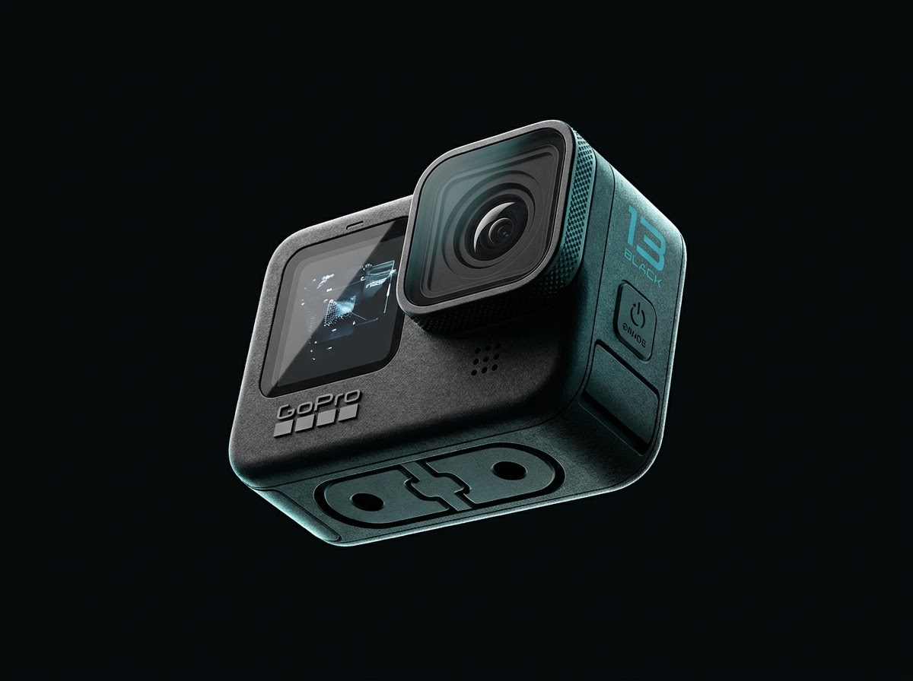

# GoPro HERO13 Black — Interactive 3D Digital Showcase

An Apple-grade, high-performance interactive product experience and engineering showcase for the **GoPro HERO13 Black**, built with React, TypeScript, Vite, and Three.js.



---

## ✨ Features

- **Interactive 3D Product Stage**: Real-time 3D model exploration with smooth orbit controls, dynamic lighting, and precision materials (`Three.js`).
- **Engineering Deconstruction (Scroll-Driven Animation)**: Frame-by-frame mechanical breakdown and internal architecture reveal driven by scroll scrub.
- **HB-Series Lens Mod Ecosystem**: Interactive lens selector showcasing Ultra Wide, Macro, Anamorphic, and ND Filter mods with auto-detection specs.
- **HyperSmooth 6.0 & Stabilization Simulator**: Visual comparison and technical breakdown of 360° Horizon Lock and video stabilization.
- **Magnetic Latch & Mounting Engine**: Triple mounting ecosystem preview (Magnetic Latch, 1/4-20 mount, folding fingers).
- **Enduro Power Architecture**: Thermal dissipation details, extended recording battery benchmarks, and power accessory breakdowns.
- **Ultra-Responsive & Performant**: Canvas-based frame rendering, lazy loading, and modern typography tokens.

---

## 🛠️ Tech Stack

- **Framework**: [React 18](https://react.dev/) + [TypeScript](https://www.typescriptlang.org/)
- **Bundler & Tooling**: [Vite 6](https://vitejs.dev/)
- **3D Graphics**: [Three.js](https://threejs.org/)
- **Styling**: Modern CSS Design Tokens & Glassmorphism
- **Deployment**: Optimized for Vercel / Netlify / GitHub Pages

---

## 🚀 Getting Started

### Prerequisites
- [Node.js](https://nodejs.org/) (version 18 or higher recommended)
- [npm](https://www.npmjs.com/) or [pnpm](https://pnpm.io/)

### Installation

1. Clone the repository:
```bash
git clone https://github.com/<YOUR_USERNAME>/gopro-hero13-black.git
cd gopro-hero13-black
```

2. Install dependencies:
```bash
npm install
```

3. Start development server:
```bash
npm run dev
```

4. Build for production:
```bash
npm run build
```

5. Preview production build locally:
```bash
npm run preview
```

---

## 📁 Project Structure

```
├── public/
│   └── assets/
│       ├── frames/        # Scroll-driven engineering breakdown frames
│       ├── lenses/        # HB-Series Lens Mod assets
│       ├── models/        # 3D GLB models
│       ├── mounting/      # Mount ecosystem graphics
│       ├── power/         # Enduro battery and power assets
│       └── product/       # High-resolution hero imagery
├── scripts/               # Automation & frame extraction tooling
├── src/
│   ├── components/
│   │   ├── 3d/            # Three.js viewport & canvas renderer
│   │   ├── navigation/    # Header & Footer navigation
│   │   └── sections/      # Hero, Engineering, Lenses, Power, Finale, etc.
│   ├── hooks/             # Custom React hooks (canvas render, scroll sync)
│   ├── styles/            # CSS tokens, animations, and global typography
│   ├── App.tsx            # Main application orchestrator
│   └── main.tsx           # React DOM root
├── index.html
├── package.json
└── vite.config.ts
```

---

## 📄 License

MIT License. Designed and built for portfolio and product demonstration.
